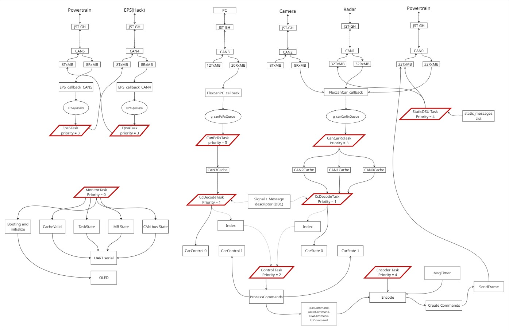

# VCU_prius

`VCU_prius` is an embedded vehicle control unit project using MR-CANHUBK344 board which has NXP S32K344
microcontroller. The application is written in embedded C, uses NXP RTD drivers generated
from S32 Configuration Tools, and runs multiple FreeRTOS tasks for CAN routing,
vehicle state decoding, control, message encoding and monitoring status. 

## Target Hardware

- MCU: NXP S32K344
- Core: Arm Cortex-M7, Thumb instruction set
- Main clock: 160 MHz core PLL clock
- Build target: flash image using

The project enables six CAN transceivers at startup and configures CAN4/CAN5 which has 
TJA1153 secure CAN transceivers before normal operation.

## Software and Tool Versions

- IDE/project type: NXP S32 Design Studio Eclipse
- Toolchain: NXP GCC 10.2 for Arm 32-bit Bare-Metal
- C standard: C99
- NXP RTD: S32K3 RTD 7.0.0
- AUTOSAR R23-11 compliant
- Extension versions:
   S32 Configuration Tools Package: 1.8.9
   S32 Design Studio Debugger Core: 3.6.5
   S32 Desgin Studio Platform Package: 3.6.5
   S32 Design Studio Platfrom Tools Package: 3.6.5
   GDB Client for Arm Embedded processors 15.1 build 1703
   NXP GCC for Arm Embedded Processors v10.2 build 1763
   s32k3xx development package: 3.6.4
   FreeRTOS for s32k3 6.0.0 CD1: 6.0.0
- FreeRTOS kernel: 10.5.1
- S32 configuration file: `VCU_prius.mex`

The generated RTD files are under `generate/`, `RTD/`, and `board/`. Manual
application code is under `src/`.

## Architecture


## Project Layout

- `src/` - application source files
- `src/include/` - application headers
- `board/` - generated pin mux and board port configuration
- `generate/` - generated peripheral configuration from S32 Configuration Tools
- `RTD/` - NXP Real-Time Drivers source and headers
- `FreeRTOS/` - FreeRTOS kernel and Cortex-M7 port
- `Project_Settings/Startup_Code/` - startup, vector table, system, and NVIC code
- `Project_Settings/Linker_Files/` - RAM and flash linker scripts
- `Project_Settings/Debugger/` - Segger launch configurations
- `Debug_FLASH/` - generated build directory and debug flash output

## Peripheral Configuration

### CAN

The firmware initializes FlexCAN instances 0 through 5.

| Bus | Instance | RX MBs | TX MBs | Main use in code | Pins | Callbacks | Error Callback |
| --- | --- | ---: | ---: | --- | --- | --- | --- |
| CAN0 | `INST_FLEXCAN0` | 32 | 32 | Car CAN RX queue | RX PTA6, TX PTA7 | FlexcanCar_callback | Flexcan_error_callback |
| CAN1 | `INST_FLEXCAN1` | 32 | 32 | Car CAN RX queue | TX PTC8, RX PTC9 | FlexcanCar_callback | Flexcan_error_callback | 
| CAN2 | `INST_FLEXCAN2` | 8 | 8 | Car CAN RX queue | TX PTE8, RX PTE9 | FlexcanCar_callback | Flexcan_error_callback |
| CAN3 | `INST_FLEXCAN3` | 20 | 12 | PC CAN RX queue | TX PTC12, RX PTC13 | FlexcanPC_callback | Flexcan_error_callback |
| CAN4 | `INST_FLEXCAN4` | 8 | 8 | EPS task queue | TX PTC14, RX PTC15 | EPS_callback_CAN4 | Flexcan_error_callback |
| CAN5 | `INST_FLEXCAN5` | 8 | 8 | EPS task queue | TX PTC10, RX PTC11 | EPS_callback_CAN5 | Flexcan_error_callback |

All FlexCAN instances are configured in normal mode, classic CAN payload size
of 8 bytes, CAN FD disabled, and interrupt-based transfer. The generated timing
uses a 24 MHz FlexCAN clock with normal timing parameters:

- Prop segment: 4
- Phase segment 1: 8
- Phase segment 2: 3
- Prescaler division factor: 3
- RJW: 2

this makes the bitrate of the CAN to be 500Kbps. 

### UART

- Peripheral: LPUART2
- Pins: RX PTA8, TX PTA9
- Desire Baudrate: 115200 baud
- Format: 8 data bits, no parity, 1 stop bit
- Transfer mode: interrupts

### I2C / OLED

- Peripheral: LPI2C0
- Pins: SDA PTD13, SCL PTD14
- Mode: fast mode, master
- Transfer mode: interrupts
- OLED driver: `src/oled_display.c`
- I2C slave address: `60` decimal (`0x3C`)
- Master prescaler: 32
- Pin low, Bus idle: 0
- Data valid delay: 1
- Setup hold delay: 2
- Clock high period: 8
- Clock low period: 3

### GPIO Ports
Siul2_Port 
The generated board configuration defines 41 configured pins. CAN transceiver
enable, standby, error, and LED pins are declared in
`board/Siul2_Port_Ip_Cfg.h`. Startup enables CAN0-CAN5 transceivers through
`Transceivers_Enable()` in `src/main.c`.

### IntCtrl_Ip
All the peripherals uses interrupts to receive and send data. Depending on the MB for each of the CAN instances the interrupts are grouped. For CAN0 there are 96MB, but we are using 64.

| Name | Interrupt name | Enabled | Priority | Handler |
| --- | --- | ---: | ---: | --- |
| can0_irq_conf_bus_off | FlexCAN0_0_IRQn | Yes | 6 | Flexcan0_bus_off_handler |
| can0_irq_conf_0_31 | FlexCAN0_1_IRQn | Yes | 6 | Flexcan0_1_handler |
| can0_irq_conf_32_63 | FlexCAN0_2_IRQn | Yes | 6 | Flexcan0_2_handler |
| can1_irq_conf_bus_off | FlexCAN1_0_IRQn | Yes | 6 | Flexcan1_bus_off_handler |
| can1_irq_conf_0_31 | FlexCAN1_1_IRQn | Yes | 6 | Flexcan1_1_handler |
| can1_irq_conf_32_63 | FlexCAN1_2_IRQn | Yes | 6 | Flexcan1_2_handler |
| can2_irq_conf_bus_off | FlexCAN2_0_IRQn | Yes | 6 | Flexcan2_bus_off_handler |
| can2_irq_conf_0_31 | FlexCAN2_1_IRQn | Yes | 6 | Flexcan2_1_handler |
| can3_irq_conf_bus_off | FlexCAN3_0_IRQn | Yes | 6 | Flexcan3_bus_off_handler |
| can3_irq_conf_0_31 | FlexCAN3_1_IRQn | Yes | 6 | Flexcan3_1_handler |
| can4_irq_conf_bus_off | FlexCAN4_0_IRQn | Yes | 6 | Flexcan4_bus_off_handler |
| can4_irq_conf_0_31 | FlexCAN4_1_IRQn | Yes | 6 | Flexcan4_1_handler |
| can5_irq_conf_bus_off | FlexCAN5_0_IRQn | Yes | 6 | Flexcan5_0_handler |
| can5_irq_conf_0_31 | FlexCAN5_1_IRQn | Yes | 6 | Flexcan5_1_handler |
| i2c0_irq_conf | LPI2C0_IRQn | Yes | 7 | I2c0_handler |
| uart2_irq_conf | LPUART2_IRQn | Yes | 7 | Uart2_handler |

### Clock_Ip_ReferencePoints

The clock is default which is the CORE_CLK at 160MHz

## Runtime Tasks

`main()` initializes pins, clocks, OS abstraction, interrupts, UART, I2C, OLED,
CAN queues, and all six CAN peripherals. It then starts the FreeRTOS scheduler
with these tasks:

- `StaticDSUTask`
- `CanCarRxTask`
- `CanPcRxTask`
- `CsDecodeTask`
- `CcDecodeTask`
- `MonitorTask`
- `EPS4Task`
- `EPS5Task`
- `ControlTask`
- `EncoderTask`

FreeRTOS is configured for a 1000Hz tick, 5 priority levels, dynamic
allocation, and a 49152 byte heap.

## Setup

1. Install NXP S32 Design Studio with S32K3 support.
2. Install or enable the NXP GCC 10.2 Arm 32-bit bare-metal toolchain.
3. Make sure the S32DS environment variables used by the project are available,
   including:
   - `S32DS_K3_ARM32_GNU_10_2_TOOLCHAIN_DIR`
   - `BASE_PLATFORMSDK_S32K3`
   - `PLATFORM_PLATFORMSDK_S32K3`
4. Import this folder as an existing project in S32 Design Studio.
5. Open `VCU_prius.mex` with S32 Configuration Tools if peripheral
   configuration needs to be reviewed or regenerated.

## Build

### From S32 Design Studio

1. Select the `Debug_FLASH` configuration.
2. Build the project.
3. The main output is:

```text
Debug_FLASH/VCU_prius.elf
```

The project also contains release/debug RAM and flash Segger launch
configurations under `Project_Settings/Debugger/`.

### From a Shell

If the S32DS toolchain is on `PATH` and the required S32DS environment variables
are set, the generated makefile can be used directly:

```sh
cd Debug_FLASH
make all
```

To clean the generated build directory:

```sh
cd Debug_FLASH
make clean
```

Note that `Debug_FLASH/makefile` is generated by S32 Design Studio and should
not be edited manually.

## Flash and Run

The project includes Segger launch files:

- `VCU_prius_Debug_FLASH_Segger.launch`
- `VCU_prius_Debug_RAM_Segger.launch`
- `VCU_prius_Release_FLASH_Segger.launch`
- `VCU_prius_Release_RAM_Segger.launch`

Use the flash launch configuration for normal board flashing. After reset, the
firmware initializes the OLED with `Booting`, enables transceivers, initializes
CAN, starts the application tasks, then writes `Initialized` before starting the
FreeRTOS scheduler.

## Notes for Developers

- Generated files may be overwritten when `VCU_prius.mex` is regenerated.
- Keep manual application changes in `src/` and `src/include/` where possible.
- CAN message buffer sizes are defined in `src/include/flexcan_conf.h`.
- Board pin names are generated in `board/Siul2_Port_Ip_Cfg.h`.
- Startup and interrupt wiring are in `src/main.c` and generated interrupt
  configuration under `generate/`.
